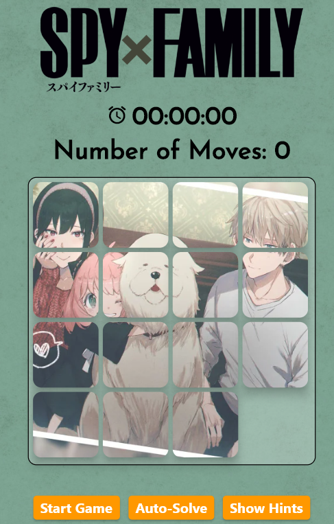

## Anime Slide Puzzle

A responsive slide puzzle game built using flutter.
If you ever get stuck, you can use the auto solver to help solve the puzzle.

The auto solver is built with IDA* algorithm using manhattan distance heuritics. 

